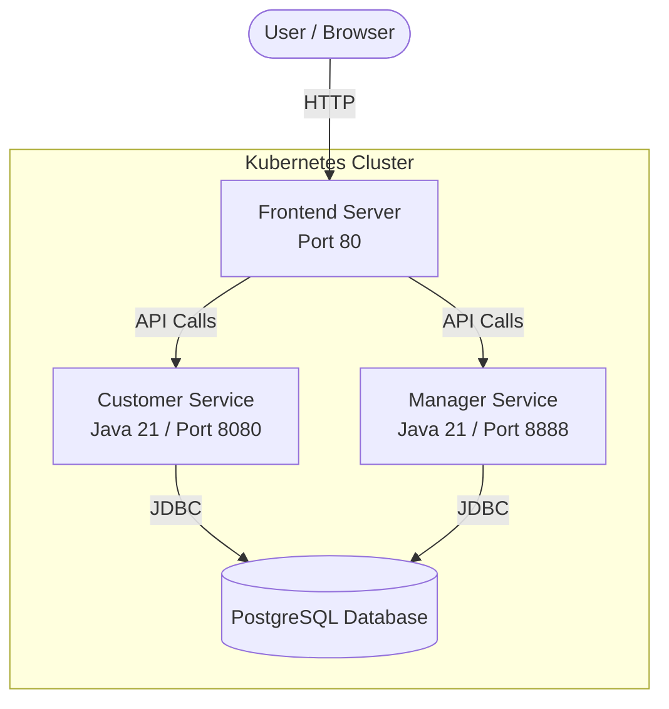

# 🎢 RollerCoaster Park Management System


A modern, cloud-native, microservices-based web application designed to manage theme park operations. This project demonstrates end-to-end software engineering capabilities—from building robust backend APIs in Java 21 to securely orchestrating containers via Kubernetes and automating deployments with CI/CD pipelines.

## 🚀 Key Features

- **Customer Portal**: A modern, glassmorphic UI allowing guests to browse park attractions, view operational statuses, and purchase digital tickets.
- **Management Dashboard**: A secure portal for park employees to submit maintenance tickets for broken rides and for management to track operations.
- **Decoupled Microservices**: The backend is split into `Customer` and `Manager` services for horizontal scalability and isolation.
- **Secure Credentials Management**: Hardcoded credentials have been stripped and replaced with Kubernetes Secrets and environment variable injection to adhere to strict 12-factor app security principles.

## 🛠️ Technology Stack

**Backend Engineering**
- Java 21, Jakarta EE (Servlets)
- Apache Tomcat 10.1
- Maven (Build & Dependency Management)
- JUnit, Mockito, & Jacoco (Automated Testing & Coverage)

**Data Layer**
- PostgreSQL
- JDBC with DAO (Data Access Object) Design Pattern

**Frontend UI / UX**
- HTML5, Vanilla JavaScript (ES6+), CSS3
- Modern Glassmorphism Aesthetic (Frosted glass cards, dynamic gradients)
- Nginx (Web Server & Cache Management)

**DevOps, Infrastructure, & CI/CD**
- **Docker**: Highly optimized, multi-stage Dockerfiles that reduce image sizes and build times.
- **Kubernetes**: Cloud-native manifests utilizing ConfigMaps, Secrets, Deployments, and Services.
- **GitHub Actions**: Automated CI/CD pipeline that checks out code, sets up JDK 21, runs the Maven test suite, and securely builds/pushes Docker images to Docker Hub upon successful tests.

## 🏗️ Architecture



1. **Frontend / Nginx**: Serves the static assets and handles caching.
2. **Customer API**: Listens on port 8080. Handles ticketing, customer registration, and public attraction listings.
3. **Manager API**: Listens on port 8888. Handles employee operations, maintenance ticket dispatching, and attraction management.
4. **PostgreSQL Database**: A relational database acting as the single source of truth for both services.

## ⚙️ CI/CD Pipeline Workflow

Every push to the `master` branch triggers the GitHub Actions pipeline (`deploy.yml`):
1. **Setup**: Provisions an `ubuntu-latest` runner and installs JDK 21 (Temurin).
2. **Test**: Compiles the source code and executes the Maven test suite via the Surefire plugin.
3. **Build**: If tests pass, it executes the multi-stage Docker builds for the Frontend, Customer API, and Manager API.
4. **Deploy**: Authenticates with Docker Hub using repository secrets and pushes the latest tagged images to the registry.

## 💻 Getting Started Locally

### Prerequisites
- Docker & Docker Compose (or Minikube for Kubernetes)

### Running with Docker
```bash
# Build the images
docker build -t coaster-customer ./Coaster_customer
docker build -t coaster-manager ./Coaster_manager
docker build -t coaster-frontend ./frontend

# (Optional) Run using a docker-compose.yml or run the containers manually
```

### Running with Kubernetes
```bash
# Ensure you have a running cluster (e.g., Minikube)
kubectl apply -f kubernetes/finalproduct.yaml

# Verify the pods are running
kubectl get pods

# Expose the services to access the UI locally
kubectl port-forward svc/frontend-service 80:80
```

## 📝 License
This project is open-source and available for educational and portfolio demonstration purposes.
